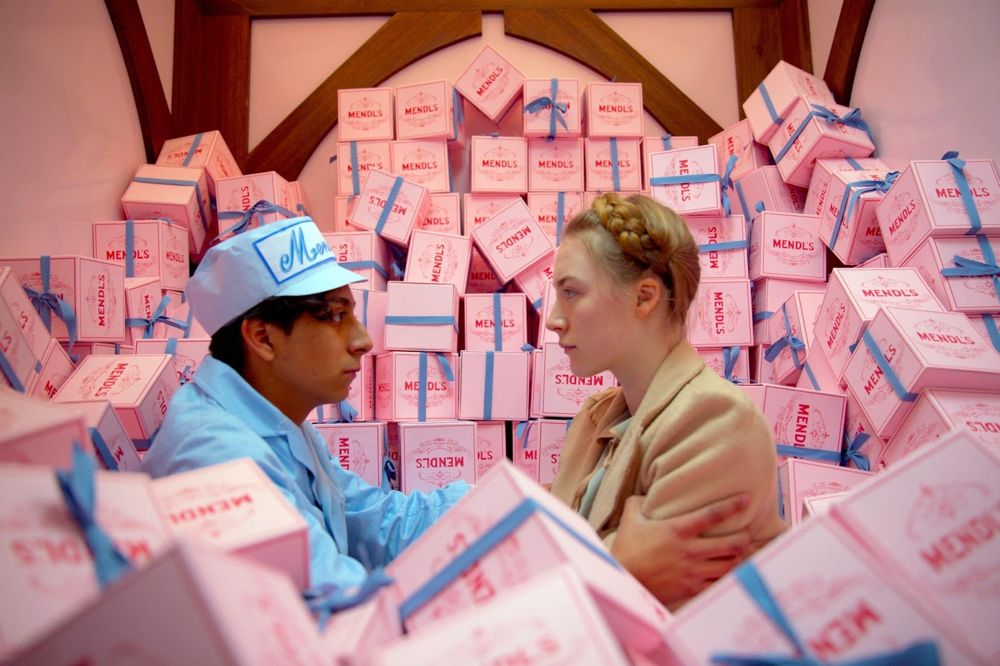

## Introducción

_El Gran Hotel Budapest_ (2014), dirigida por Wes Anderson, es una de las obras más representativas del cine contemporáneo de autor. A medio camino entre la comedia, el cine de aventuras y la fábula nostálgica, la película propone un viaje a un mundo ficticio tan estilizado como emotivo. A través de una narración fragmentada y un tono irónico constante, Anderson construye una historia que reflexiona sobre el paso del tiempo, la memoria y la desaparición de una Europa idealizada.

## Una historia entre el humor y el misterio

La película narra las aventuras de Gustave H., el excéntrico y refinado conserje de un lujoso hotel europeo, y su joven aprendiz Zero Moustafa. La trama se articula en torno a una herencia disputada, un asesinato y una persecución, elementos propios del cine de misterio, pero tratados siempre desde una comedia elegante y absurda. Esta combinación de géneros permite que la narración avance con ligereza sin perder coherencia ni interés.

## El hotel como centro del universo narrativo

El Gran Hotel Budapest no es solo el escenario principal, sino un auténtico personaje más. El edificio funciona como eje vertebrador del relato y como símbolo de un mundo refinado que está condenado a desaparecer. A través de sus espacios interiores, la película construye un microcosmos regido por normas estrictas, rituales sociales y una estética exagerada que define la identidad de sus habitantes.

## Una estética visual inconfundible

Uno de los aspectos más destacados de la película es su estilo visual, sello inconfundible de Wes Anderson. El uso sistemático de la simetría, los encuadres centrados y la composición geométrica genera una sensación de orden y artificio deliberado. Cada plano parece cuidadosamente diseñado, reforzando la idea de que el espectador se encuentra ante un mundo casi irreal, cercano al de una maqueta o una ilustración animada.

## El uso del color y la ambientación

La paleta cromática juega un papel esencial en la construcción del tono del relato. Los colores pastel —especialmente rosas, rojos y púrpuras— dominan las escenas del hotel, aportando un aire de fantasía y sofisticación. En contraste, los tonos más apagados aparecen en otras localizaciones, subrayando los cambios temporales y emocionales. Los decorados, cargados de detalles minuciosos, refuerzan la sensación de estar ante un cuento visual cuidadosamente construido.

## El estilo “Wes Anderson”

El estilo de Anderson no se limita a lo visual. El ritmo acelerado de los diálogos, la narración en distintas capas temporales y el uso puntual del stop-motion contribuyen a una experiencia cinematográfica muy singular. Todo ello crea una atmósfera que mezcla humor, nostalgia y una sutil melancolía, rasgos recurrentes en la filmografía del director.

## Interpretaciones y personajes

Ralph Fiennes destaca especialmente en su interpretación de Gustave H., aportando carisma, precisión cómica y una inesperada profundidad emocional. El resto del reparto coral encaja perfectamente en el universo del director, dando vida a personajes exagerados pero coherentes dentro del tono general de la obra. Cada actor aporta un matiz distinto que enriquece el conjunto.

## Conclusión

_El Gran Hotel Budapest_ es una película que sobresale tanto por su propuesta estética como por su capacidad narrativa. Más allá de su apariencia colorida y su humor peculiar, es una reflexión sobre la decadencia de una época y el valor de los recuerdos. Se trata de una obra envolvente, original y profundamente autoral, que consolida a Wes Anderson como uno de los cineastas más reconocibles e influyentes del cine actual.

{: width="1000px"}
